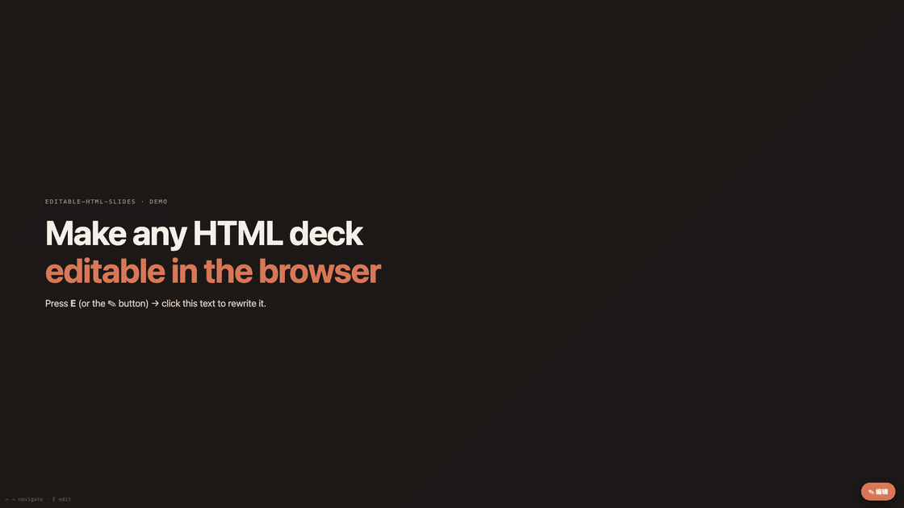
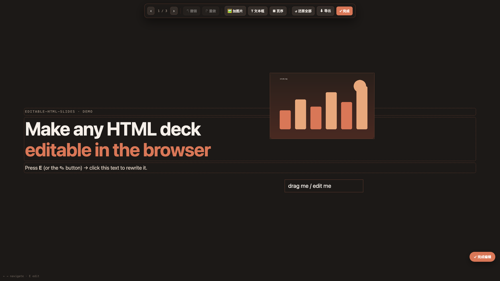
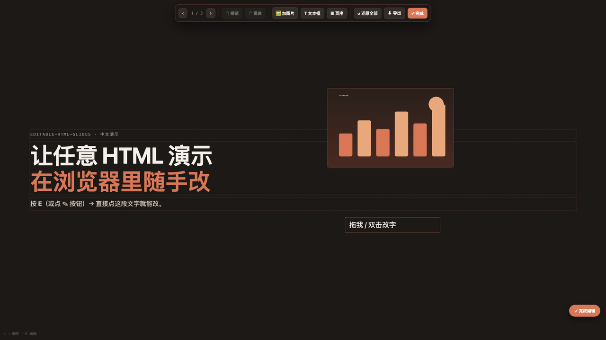

# editable-html-slides

> A zero-dependency, in-browser **WYSIWYG editor** you can bolt onto any HTML
> slide deck — so the deck stays **editable after it's generated**.

AI coding agents are great at *generating* beautiful HTML decks, but the output
is read-only to a normal user — to change a title or swap an image they'd have to
open the source. This skill closes that gap with two small files
(`editor.js` + `editor.css`) that layer a visual editor on top of an existing
deck, **without touching its design** and **without a build step, Node, or npm**.

It pairs especially well with [html-ppt](https://github.com/lewislulu/html-ppt-skill)
/ reveal-style decks — it preserves their presenter view and speaker notes — but
works on any deck using the `.slide` / `.is-active` convention.



<p align="center">
  
  
</p>

> 中文：把 AI 生成的静态 HTML 演示变成**能在浏览器里随手改**的演示——点字直接改、
> 拖图片进去、撤销重做、拖缩略图换页序、自动保存、导出干净 HTML。零依赖，不毁原设计，
> 保留逐字稿。按 **E** 或点 ✎ 进入编辑。

## Features

- ✏️ **Inline text editing** — click any heading/paragraph/list item and type
- 🖼 **Add images** — local file (embedded as data URL) or paste with ⌘/Ctrl+V
- 🔤 **Add text boxes** — free-floating, double-click to edit
- ✋ **Drag / resize / delete** added objects
- ↶ **Undo / redo** — ⌘/Ctrl+Z, ⌘/Ctrl+Shift+Z (80-step snapshot history)
- ▦ **Reorder slides** — draggable thumbnail filmstrip
- 💾 **Autosave** to `localStorage` + ⬇ **export** a clean standalone HTML
- 🎤 Non-edit mode is unchanged — still presentable (S / arrows / themes, etc.)

Toggle with the **✎ button** or the **E** key. **Esc** / ✓ to exit.

## Install as a Claude skill

```bash
npx skills add rossyao2022/editable-html-slides -g
```

or clone into your skills directory:

```bash
git clone https://github.com/rossyao2022/editable-html-slides \
  ~/.claude/skills/editable-html-slides
```

## Use it on a deck

```bash
python3 scripts/inject.py /abs/path/to/your-deck/index.html
# then open index.html and press E
```

The injector copies `editor.css` + `editor.js` next to your deck and wires two
tags in (idempotently). Prefer to do it by hand? Add:

```html
<link rel="stylesheet" href="editor.css">      <!-- in <head> -->
<script src="editor.js"></script>               <!-- before </body>, AFTER the deck's runtime -->
```

## Try the demo

Open [`examples/demo.html`](examples/demo.html) — a tiny self-contained deck (with
a 30-line minimal runtime) — and press **E**. No other dependencies.

## How it works

See [`references/runtime-notes.md`](references/runtime-notes.md) for the design:
the **slot-fixed, content-swap** reorder model (so it never disturbs a presenter
runtime's cached page order), the snapshot-based undo stack, the `.overview`
double-count gotcha, and how to retarget the selectors for a non-standard deck.

## Requirements

The deck's slides should use class `.slide`, with the visible one marked
`.is-active`, ideally inside a `.deck` container. Speaker notes in
`<aside class="notes">` are preserved and never turned into editable on-slide
text. No Node, npm, build, or network required.

## How it compares to other slide / PPT skills

These tools mostly **generate** decks. `editable-html-slides` is different — it
**adds editing to a deck you already have**, so it composes with the generators
rather than competing with them. An honest side-by-side:

| | **editable-html-slides** (this) | [html-ppt](https://github.com/lewislulu/html-ppt-skill) | [frontend-slides](https://github.com/zarazhangrui/frontend-slides) | frontend-slides-editable | Claude for PowerPoint |
|---|---|---|---|---|---|
| Primary job | **make an existing deck editable** | generate HTML decks (+ presenter mode) | generate HTML decks | generate + edit HTML decks | generate/edit native `.pptx` |
| Dependencies | **none** (no Node/npm/build) | none | Node (+ Python for PPT import) | Node 18+ | PowerPoint + paid plan |
| In-browser text edit | ✅ | ❌ (edit source) | ✅ (light) | ✅ | ✅ |
| Add image / drag / resize | ✅ | ❌ | ⚠️ limited | ✅ (+ multi-select, video) | ✅ |
| Undo / redo | ✅ | ❌ | ❌ | ✅ | ✅ |
| Reorder slides (drag) | ✅ filmstrip | via source | ❌ | ✅ | ✅ |
| Import existing PPT/PDF | ❌ | ❌ | ✅ PPT→HTML | ✅ (lossy redesign) | — (already PPT) |
| Export | ✅ single-file HTML | — | ✅ + deploy URL / PDF | ✅ single-file | native `.pptx` |
| **Keeps your existing design + speaker notes** | ✅ **untouched** | n/a (it *is* the deck) | ❌ regenerates | ❌ conversion redesigns | ❌ |

**Pick this when** you've already generated a deck you like (e.g. with html-ppt)
and just want it to stay editable for non-developers — without a build step or
losing the design/notes. **Pick a generator** (html-ppt, frontend-slides) when
you need to create a deck from scratch. **Pick frontend-slides-editable** when you
want a heavier editor (multi-select, video, PPT import) and don't mind Node.
**Pick Claude for PowerPoint** when the deliverable must be a native `.pptx`.

## License

MIT © rossyao2022
